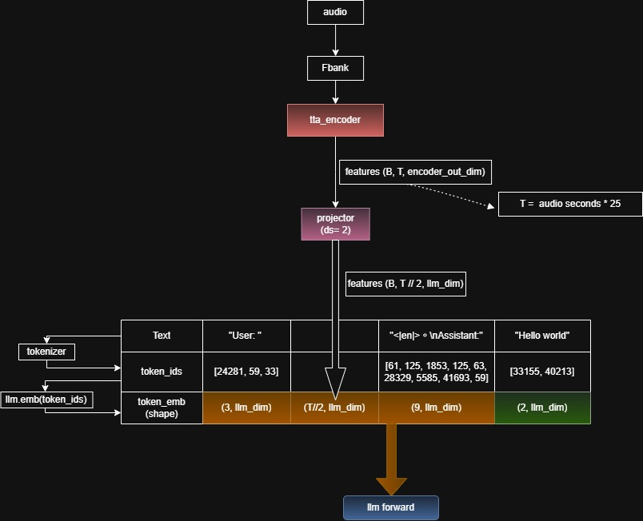

# ZipRWKV-Speech (Research Stage)
[English] | [中文版](./README.zh-CN.md)

ZipRWKV-Speech is a Speech-LLM based Automatic Speech Recognition (ASR) system. Its core architecture utilizes **Zipformer** as the speech encoder, integrated with **RWKV7** as the language model backbone.

> [!IMPORTANT]

> **Research Phase Disclaimer**: This project is currently in the experimental/development stage and serves primarily as a personal implementation record. The codebase draws from several open-source projects (such as NeMo, K2, and RWKV), extracting and simplifying key components to create a lightweight yet high-performance SpeechLLM framework. Each module contains its own README to explain the implementation logic.

---

## 🏗️ System Architecture
* **Speech Encoder:** Zipformer (from K2/Icefall), providing efficient downsampling and feature extraction.

* **LLM Backbone:** RWKV7, combining the inference efficiency of RNNs with the training performance of Transformers.

* **Data Pipeline:** A dynamic bucketing system based on Lhotse.

## 🚀 Development Roadmap
Current progress on code organization and implementation:

- [x] **Data Pipeline (Lhotse-based)**
    - [x] Support for NeMo-style Manifest loading.
    - [x] Implementation of `DynamicBucketingSampler` for dynamic Batch Size adjustment.
    - [x] Integration of `Cutset.mux` for weighted multi-source data mixing.
    - [x] On-the-fly data augmentation (Speed, Volume, Noise, SpecAugment).
    - [x] test dataset code and `conf.yaml`.
    - [x] noise manifest prepare script.
- [X] **Model Architecture**
    - [X] Zipformer Encoder integration and test code.
    - [X] RWKV7 and PEFT (Parameter-Efficient Fine-Tuning) integration.
- [ ] **Training Implementation**
    - [ ] PyTorch Lightning Training Module.
- [ ] **Checkpoints & Evaluation**
    - [ ] Release of pre-trained model weights.

<details>
<summary><h3> K2 Installation Guide </h3></summary>

## Environment Requirements

- Python 3.10
- CUDA 12.8
- PyTorch 2.8

## Installation Steps

### 1. Download K2 Wheel

Download the [K2 wheel](https://k2-fsa.github.io/k2/cuda.html) file that matches your environment configuration:

```bash
wget https://k2-fsa.github.io/k2/cuda.html
wget k2-1.24.4.dev20250807+cuda12.8.torch2.8.0-cp310-cp310-manylinux_2_27_x86_64.manylinux_2_28_x86_64.whl
```

### 2. Fix the Downloaded Filename

Sometimes the `+` character in the filename may be converted to `%2B` after download. You need to rename it back to `+`:

```bash
# If the filename contains %2B, change it to +
# Original filename: k2-1.24.4.dev20250807%2Bcuda12.8.torch2.8.0-cp310-cp310-manylinux_2_27_x86_64.manylinux_2_28_x86_64.whl
# New filename: k2-1.24.4.dev20250807+cuda12.8.torch2.8.0-cp310-cp310-manylinux_2_27_x86_64.manylinux_2_28_x86_64.whl
```

### 3. Install K2

Install the wheel package using `uv pip`:

```bash
uv pip install "k2-1.24.4.dev20250807+cuda12.8.torch2.8.0-cp310-cp310-manylinux_2_27_x86_64.manylinux_2_28_x86_64.whl"
```
</details>

## Zipformer Encoder

This project uses [`AudenAI/auden-encoder-tta-m10`](https://huggingface.co/AudenAI/auden-encoder-tta-m10) as the encoder for Zipformer.


<details>
<summary><h3> LLM-Based ASR: Audio-Text Embedding Fusion Concepts </h3></summary>


## Key Concepts



### Concept 1: Audio Downsampling and Token-Level Alignment

**Encoder Output to Tokens**

After audio encoding (Fbank → Encoder), the encoder output features are processed through a **projector** that performs downsampling:

- **Encoder output shape**: `(B, T, encoder_out_dim)` where T = audio_seconds × 25
- **After projector downsampling**: `(B, T//2, lim_dim)`
- **Resulting temporal resolution**: ~12.5 Hz
  - Each token represents **80ms** of audio
  - **Typical Chinese character duration**: 0.2~0.3 seconds
  - **Tokens per character**: 2~4 tokens


### Concept 2: Prompt Design and LLM Compatibility

**Model-Specific Prompt Formats**

Different pre-trained LLM models require different prompt structures, which are already defined during their training:

- **RWKV7**: Simple format like `User: ` and `Assistant:`
- **Qwen**: Special tokens such as `<|im_start|>` and `<|im_end|>`
- **ASR-specific prompts**: Common Chinese prompts include "請轉錄這段{lang}語音" (Please transcribe this {lang} audio)

Additional information: Some papers have also proposed a prompt projector module to address the impact of prompts. [Reducing Prompt Sensitivity in LLM-based Speech Recognition Through Learnable Projection](https://arxiv.org/html/2601.20898v1)

**Prompt Projector Alternative**

[Recent papers](https://arxiv.org/html/2409.19510v2) have proposed using a simpler approaches work well in practice:

- A straightforward special token like `<|en|>` (or `<|zh|>` for Chinese) is often sufficient
- This lightweight approach reduces computational overhead while maintaining effectiveness
- Language specification helps the model adapt its decoding strategy appropriately

### Concept 3: Fusion and LLM Forward Pass

**Embedding Concatenation Strategy**

The key to the entire system is simple concatenation:

1. **Downsampled audio features**: Shape `(B, T//2, lim_dim)`
2. **Text embeddings**: Various prompt tokens and assistant markers
3. **Concatenation**: Place audio features immediately after the `User: ` embedding
4. **Combined input**: `[User_emb] + [Audio_tokens] + [Assistant_emb] + [Label_emb]` with total shape `(B, seq_len, lim_dim)`

**Training vs. Inference Difference**

- **Training**: 
  - Concatenate orange portion + green portion
  - Feed the entire sequence to the LLM for forward pass
  - Compute loss on the green portion to train the model

- **Inference**:
  - Only the orange portion is needed
  - The green portion is generated by the LLM's autoregressive decoding
  - No need to provide target text at inference time


## Summary

The elegance of this approach lies in its simplicity:

1. **Downsampling** creates naturally-aligned tokens (~80ms each) that correspond well with phonetic units
2. **Prompt design** is straightforward and model-dependent; language indicators are sufficient
3. **Fusion** is simply concatenation of embeddings in a specific order
4. **Training/Inference asymmetry** leverages the LLM's inherent ability to generate text autoregressively

By combining downsampled audio features with carefully formatted text prompts, the system enables LLMs to perform effective end-to-end ASR without complex architectural modifications.

</details>


## 🙏 Acknowledgements
We borrowed a lot of code from the following excellent projects:
- [rwkv7](https://github.com/BlinkDL/RWKV-LM)
- [rwkv_asr](https://huggingface.co/yueyulin/rwkv_asr)
- [speechllm](https://github.com/zhu-han/SpeechLLM)
- [Auden](https://github.com/AudenAI/Auden)
- [Zipformer_Lightning](https://github.com/ZQuang2202/Zipformer_Lightning)
- [icefall](https://github.com/k2-fsa/icefall)